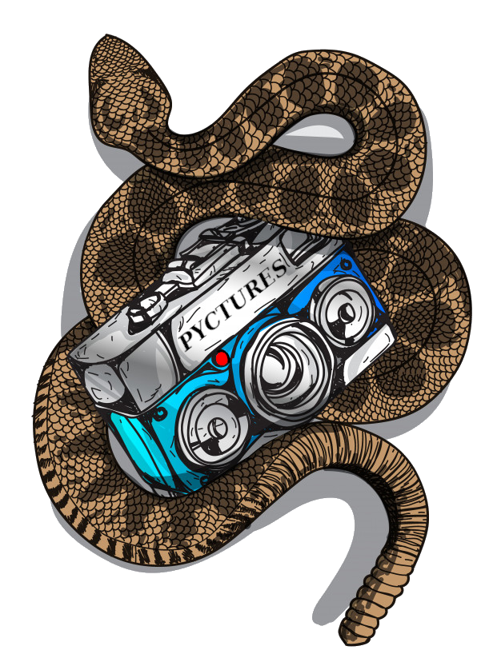
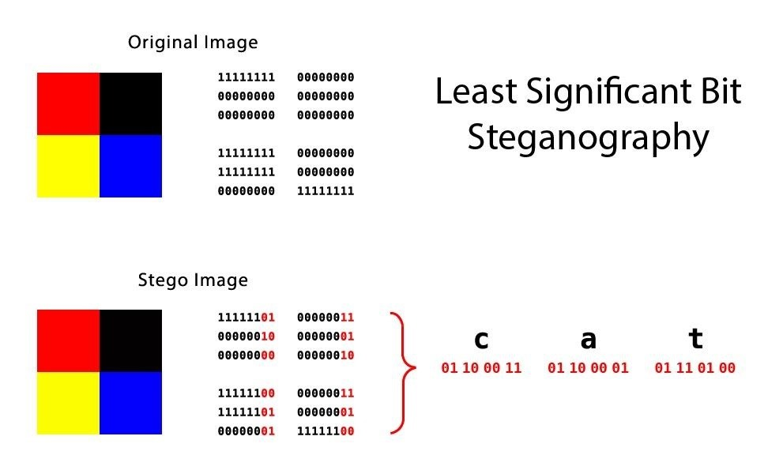
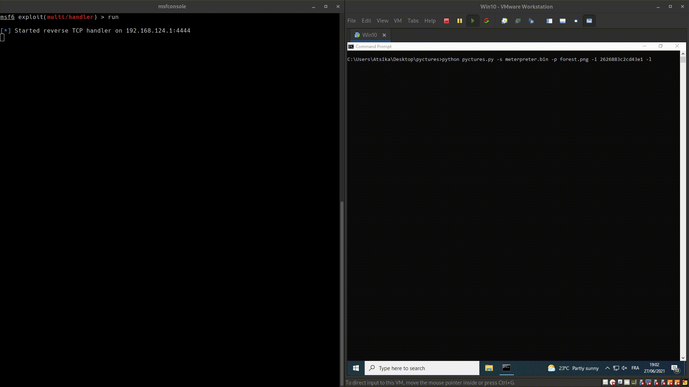

# Pyctures 🐍📷

[](https://www.microsoft.com/en-us/windows/windows-11)  [](https://www.python.org/)  [](https://en.wikipedia.org/wiki/MIT_License) [](https://www.python.org/) 

Embed shellcode in pictures using Least Significant Bit

## Introduction

Pyctures is a tool made in python, designed to embed shellcode in pictures using a well-known steganographic technique called Least Significant Bit (abbreviated to LSB).

<p align=center>
    
</p>

## Features

* Fast shellcode embedding (depends on shellcode size)
* Automatic pictures upload to imgur
* In-memory picture processing
* x86 and x64 shellcode injector
* Classic shellcode injection method
* Find process by name and injects it

## Functionning

**How does it work ?**

Pretty well. Jokes aside, Pyctures uses a well-known steganograpic technique called [Least Significant Bit](https://en.wikipedia.org/wiki/Least_significant_bit) (abbreviated LSB). It takes a raw shellcode as input, reads it as a byte array, loop over each pixel, sets RGB LSB accordingly to shellcode's bits, saves new "infected" image. Image's name is shellcode's size in bits so a loader can know it as well.

<p align=center>
    
</p>

**[imgur.com](https://apidocs.imgur.com/)**

Pyctures has the ability to directly upload new generated image to [imgur.com](https://imgur.com/). It returns the uploaded image id and url to grab it later.

**What about the loader ?**

Pyctures brings a simple PoC shellcode from LSB loader. It gets the image using imgur's api by passing image's id and title. Image's title is the name of the image (shellcode's size). Image is processed in memory using a IOBytes python object, it never touches the disk. Shellcode is rebuilt and injected in a process using the classic method _[VirtualAllocEx](https://docs.microsoft.com/en-us/windows/win32/api/memoryapi/nf-memoryapi-virtualallocex)_, _[WriteProcessMemory](https://docs.microsoft.com/en-us/windows/win32/api/memoryapi/nf-memoryapi-writeprocessmemory)_, _[CreateRemoteThread](https://docs.microsoft.com/en-us/windows/win32/api/processthreadsapi/nf-processthreadsapi-createremotethread)_.

## Usage

**How to use it ?**

```
usage: pyctures.py [-h] -s FILE -p PICTURE [-i ID] [-l]

Embed shellcode into a picture using LSB

optional arguments:
  -h, --help            show this help message and exit
  -s FILE, --shellcode FILE
                        Path to raw shellcode
  -p PICTURE, --picture PICTURE
                        Picture to inject shellcode into
  -i ID, --imgur-client-id ID
                        imgur client id to upload picture
  -l, --loader          Build loader
```

```
$ python pyctures.py -s shellcode.bin -p cat.png -i ImgurClientId -l
```

## Demo



<br>
<p align=center>Made with ❤️ by <a href="https://twitter.com/_atsika">Atsika</a> & <a href="https://twitter.com/MatthewsSean6">Leco</a></p>